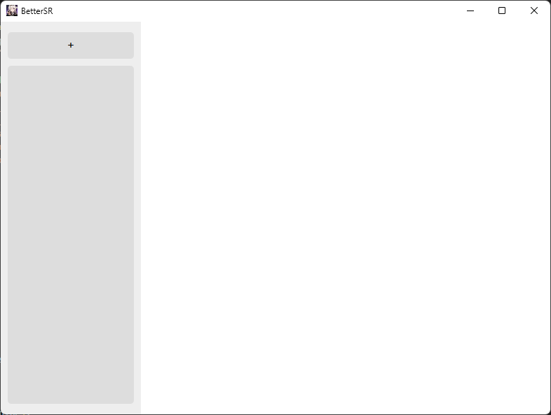
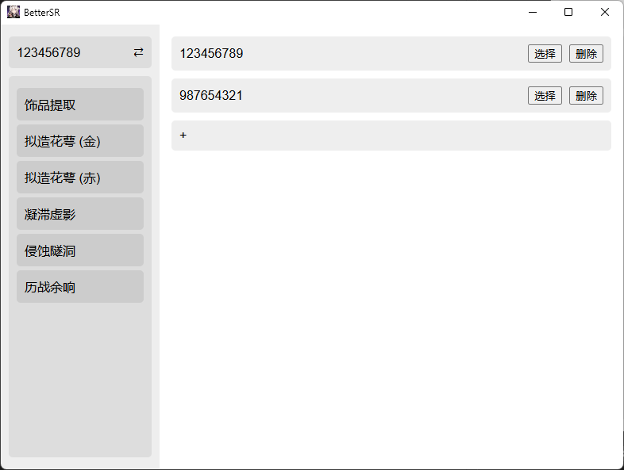
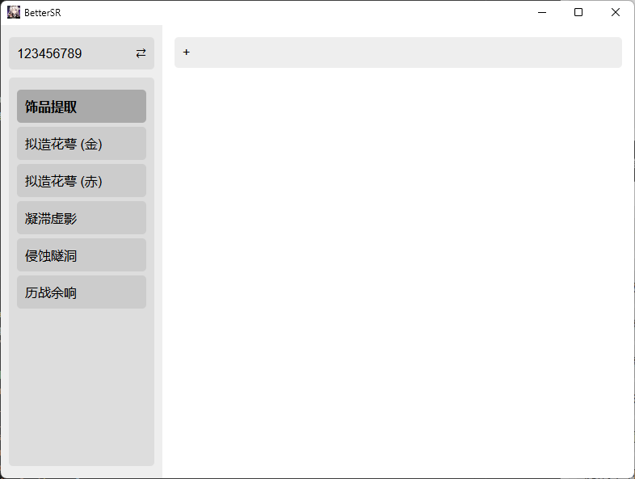
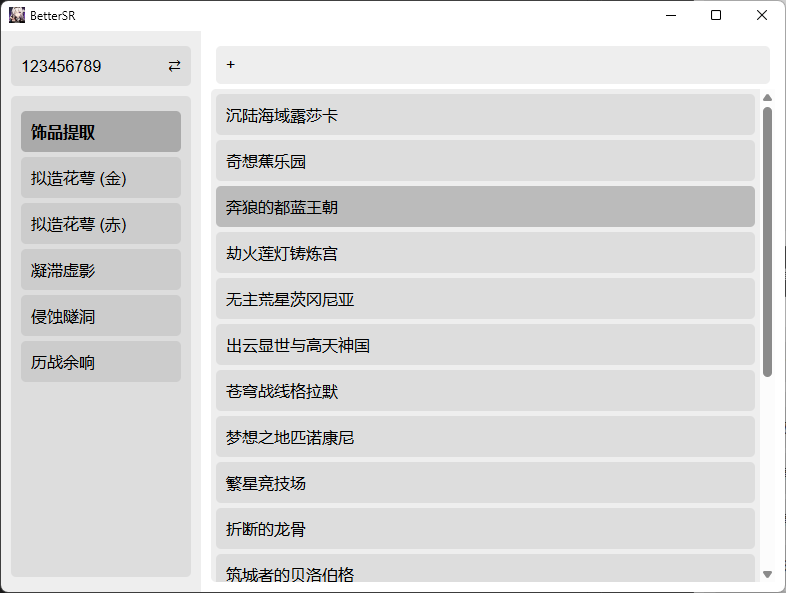
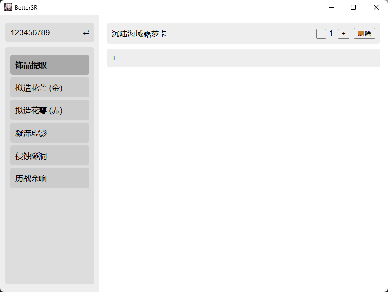
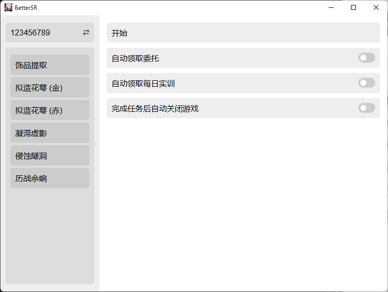

# [简体中文](README.md) | English

# BetterSR
BetterSR is a tool that automates multiple routine tasks in Honkai: Star Rail. It is especially useful during content drought periods for farming materials efficiently.

## Installation

Below are Windows (PowerShell, Administrator) instructions. Adjust paths if you customize installation locations.

### 0. Install winget (if not already installed)
Download from Microsoft Store:
https://apps.microsoft.com/detail/9nblggh4nns1

Open the Run dialog (Win + R), type:
```
powershell
```
Then press Ctrl + Shift + Enter to open an elevated (Administrator) PowerShell.

### 1. Allow script execution (temporary relaxation)
```sh
Set-ExecutionPolicy -ExecutionPolicy Bypass
```
Close this PowerShell window afterwards.

Re-open an elevated PowerShell the same way (Win + R → powershell → Ctrl + Shift + Enter).

### 2. Install Git
```sh
winget install --id Git.Git -e --source winget
```

### 3. Install Miniconda
Primary download:
```sh
curl https://repo.anaconda.com/miniconda/Miniconda3-latest-Windows-x86_64.exe -o miniconda.exe
Start-Process -FilePath ".\miniconda.exe" -ArgumentList "/S" -Wait
del miniconda.exe
```
If the above fails (network issues), alternative Tsinghua mirror:
```sh
curl https://mirrors.tuna.tsinghua.edu.cn/anaconda/miniconda/Miniconda3-latest-Windows-x86_64.exe -o miniconda.exe
Start-Process -FilePath ".\miniconda.exe" -ArgumentList "/S" -Wait
del miniconda.exe
```

### 4. (Optional) Add Miniconda to PATH manually
Only needed if you chose not to let the installer modify PATH:
```powershell
$condaPath = "$env:USERPROFILE\miniconda3"
$sysPath = [Environment]::GetEnvironmentVariable("Path", "Machine")
[Environment]::SetEnvironmentVariable("Path", $sysPath + ";$condaPath;$condaPath\Scripts;$condaPath\lib\site-packages", "Machine")
[Environment]::SetEnvironmentVariable("Path", $env:Path + ";$condaPath;$condaPath\Scripts;$condaPath\condabin;$condaPath\Library\mingw-w64\bin;$condaPath\Library\usr\bin;$condaPath\Library\bin;[...]",
"User")
```
(Original Chinese version truncates the last part with [...]; keep your previously working PATH segments if already configured.)

### 5. (Optional, China mainland users) Configure Conda mirrors
```sh
conda config --add channels https://mirrors.tuna.tsinghua.edu.cn/anaconda/pkgs/main
conda config --add channels https://mirrors.tuna.tsinghua.edu.cn/anaconda/pkgs/r
conda config --add channels https://mirrors.tuna.tsinghua.edu.cn/anaconda/pkgs/msys2
conda config --set custom_channels.conda-forge https://mirrors.tuna.tsinghua.edu.cn/anaconda/cloud/conda-forge
conda config --set custom_channels.pytorch https://mirrors.tuna.tsinghua.edu.cn/anaconda/cloud/pytorch
```

### 6. Clone the repository
```sh
git clone https://github.com/RACErace/brs.git
cd brs
```

### 7. Create a virtual environment
```sh
conda create --name BetterSR python=3.12.4 -y
```

### 8. Activate the environment
```sh
conda init BetterSR
conda activate BetterSR
```

### 9. Install PaddlePaddle
Set PyPI mirror (optional; remove this line if you prefer the default PyPI):
```sh
pip config set global.index-url https://mirrors.tuna.tsinghua.edu.cn/pypi/web/simple
```
Then follow the official PaddlePaddle quick install guide for the correct command (CPU / GPU / CUDA version):
https://www.paddlepaddle.org.cn/install/quick

Example (CPU only, may differ):
```sh
pip install paddlepaddle
```

For GPU (example only, adjust to your CUDA version, see official docs):
```sh
pip install paddlepaddle-gpu==3.0.0.postXXX -f https://www.paddlepaddle.org.cn/whl/link.html
```

### 10. Install Python dependencies
```sh
python -m pip install -r requirements.txt
```

## Usage

The program currently only supports running the game in full screen at 2560×1600 or 2560×1440 resolution.

### Launch the application
```sh
python launch.py
```

### Main Features
- Customizable automated farming of various materials
- Automatically claim assignment (commission) rewards
- Automatically claim daily rewards
- Multi‑account management

### UI / Workflow Preview
(Images intentionally referenced; if they show as broken, ensure img/00.png ... img/05.png exist.)

1. Click the + in the upper-left to add an account  
   
2. Use the ⇄ button to switch/manage multiple accounts  
   
3. Click different options on the left to select instances/dungeons  
   
4. Click the + on the right to add an instance to the execution list; click entries to add tasks  
   
5. Use - / + / 删除 (Delete) on each task row to adjust counts or remove tasks  
   
6. Select the account (top-left), then click Start (开始) on the right to begin automation  
   

## Subsequent Runs
Open an elevated PowerShell (if required for environment) and execute:
```sh
cd brs
conda activate BetterSR
python launch.py
```

## TODO (Planned)
- Automatically collect mail attachments
- MiYoUShe (HoYoLAB) daily sign-in
- Auto-lock relics (artifacts) after farming
- Specify which account executes which automation batch

## Contributing
Contributions are welcome! Feel free to open Issues or submit Pull Requests.

Recommended steps:
1. Fork the repository
2. Create a feature branch
3. Commit with descriptive messages
4. Open a PR describing changes, motivation, and testing steps

## License
This project is licensed under the MIT License. See the LICENSE file for details.

## Disclaimer
This project is an unofficial helper/automation tool for Honkai: Star Rail. Use at your own risk. Respect the game’s Terms of Service— excessive or detectable automation may carry account risk.
