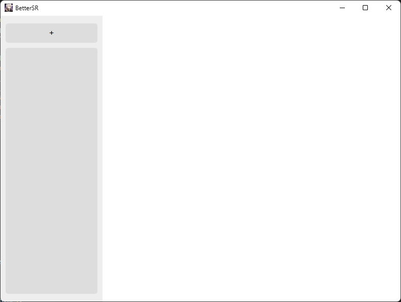
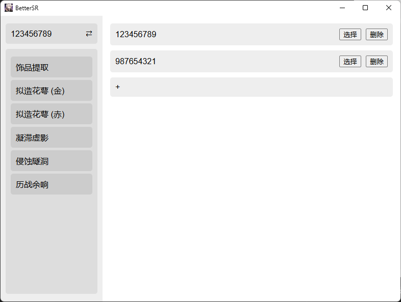
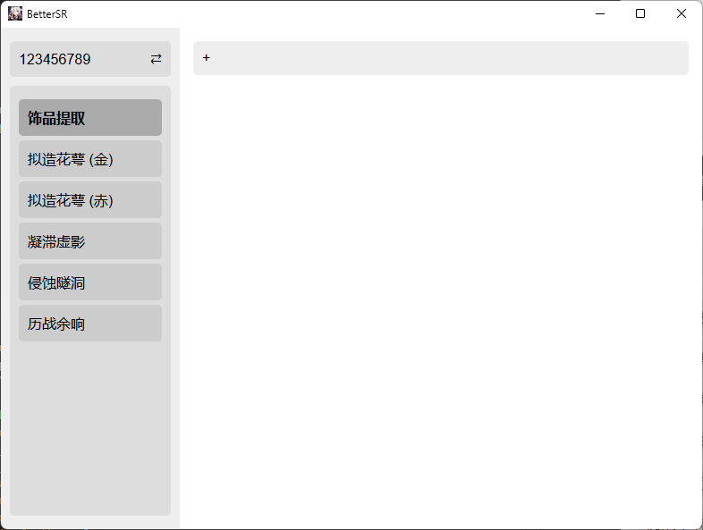
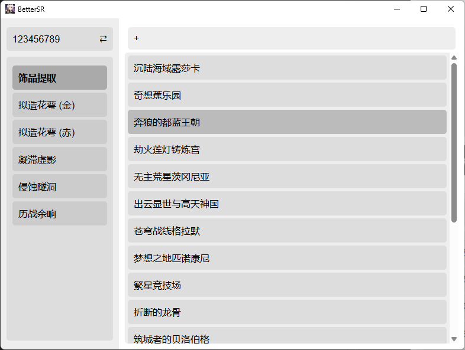
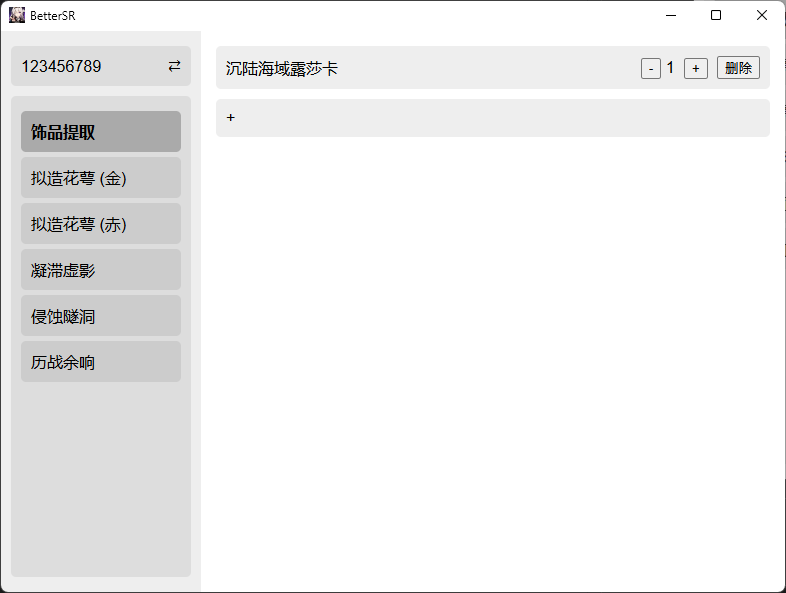
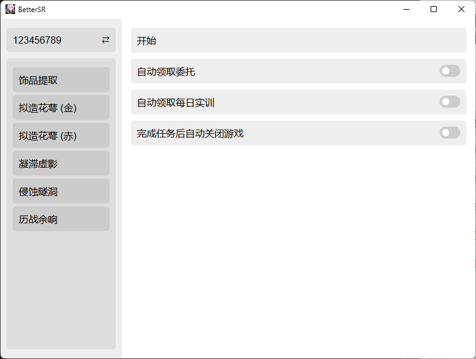

# BetterSR
BetterSR 是一个可以自动化完成《崩坏：星穹铁道》中多项任务的工具。在长草期刷取材料的时候极其适用。
## 安装

你可以先从[这里](https://apps.microsoft.com/detail/9nblggh4nns1?rtc=1&hl=zh-cn&gl=CN#activetab=pivot:overviewtab)下载的`winget`

然后通过同时按下键盘上的 `win` 和 `R` 键来打开“运行”窗口

在输入框中输入 `powershell` ，然后同时按下 `Ctrl` + `Shift` + `Enter` 以管理员身份打开 `powershell` 命令行窗口

按照下面的步骤依次复制相应的命令并将其粘贴到 `powershell` 终端中

更改 `powershell` 设置
```sh
Set-ExecutionPolicy -ExecutionPolicy Bypass
```

1. 下载git
    ```sh
    winget install --id Git.Git -e --source winget
    
    ```
2. 下载Miniconda
    - **下载并安装 `Miniconda`**
       ```sh
       curl https://repo.anaconda.com/miniconda/Miniconda3-latest-Windows-x86_64.exe -o miniconda.exe
       Start-Process -FilePath ".\miniconda.exe" -ArgumentList "/S" -Wait
       del miniconda.exe
       
       ```
    
       如果在执行上面命令的过程中出现错误，你可以尝试下面的命令
       ```sh
       curl https://mirrors.tuna.tsinghua.edu.cn/anaconda/miniconda/Miniconda3-latest-Windows-x86_64.exe -o miniconda.exe
       Start-Process -FilePath ".\miniconda.exe" -ArgumentList "/S" -Wait
       del miniconda.exe
   
       ```

   - **将 `Miniconda` 添加到环境变量**
       ```sh
       $condaPath = "$env:USERPROFILE\miniconda3"
       $sysPath = [Environment]::GetEnvironmentVariable("Path", "Machine")
       [Environment]::SetEnvironmentVariable("Path", $sysPath + ";$condaPath;$condaPath\Scripts;$condaPath\lib\site-packages", "Machine")
       [Environment]::SetEnvironmentVariable("Path", $env:Path + ";$condaPath;$condaPath\Scripts;$condaPath\condabin;$condaPath\Library\mingw-w64\bin;$condaPath\Library\usr\bin;$condaPath\Library\bin;$condaPath\lib\site-packages", "User")
       
       ```

    - **可以选择切换到清华源**
       ```sh
       conda config --add channels https://mirrors.tuna.tsinghua.edu.cn/anaconda/pkgs/main
       conda config --add channels https://mirrors.tuna.tsinghua.edu.cn/anaconda/pkgs/r
       conda config --add channels https://mirrors.tuna.tsinghua.edu.cn/anaconda/pkgs/msys2
       conda config --set custom_channels.conda-forge https://mirrors.tuna.tsinghua.edu.cn/anaconda/cloud/conda-forge
       conda config --set custom_channels.pytorch https://mirrors.tuna.tsinghua.edu.cn/anaconda/cloud/pytorch

       ```


4. 克隆仓库：
    ```sh
    git clone https://github.com/RACErace/brs.git
    cd brs
    
    ```

5. 配置环境

    - **建议使用虚拟环境**
        ```sh
        conda create --name BetterSR python=3.12.4 -y
        
        ```

    - **激活虚拟环境**
        ```sh
        conda init BetterSR
        conda activate BetterSR
        
        ```

6. 安装PaddlePaddle
    - **切换到清华源**
        ```sh
        pip config set global.index-url https://mirrors.tuna.tsinghua.edu.cn/pypi/web/simple
        ```
        
    - **您的机器安装的是CUDA 11，请运行以下命令安装**
        ```sh
        pip install paddlepaddle-gpu
        
        ```

    - **您的机器是CPU，请运行以下命令安装**
        ```sh
        pip install paddlepaddle
        
        ```

8. 安装依赖：
    ```sh
    pip install -r requirements.txt
    python setup.py
    
    ```

## 使用

该程序只适用于在2560\*1600或2560\*1440的分辨率的显示器上以全屏运行游戏的情形使用。


### 启动应用

运行 `launch.py` 启动应用：
```sh
python launch.py

```

### 主要功能

- **自定义自动刷取各种材料**
- **自动领取委托奖励**
- **自动领取每日奖励**
- **支持多账号管理**

### 功能展示

- **你可以通过点击左上角的`+`号来添加一个账号**

    

- **通过点击`⇄`来管理多个账号**

    

- **点击左侧不同选项可以选择不同的副本**

    

- **点击右侧的 `+` 号可以添加要执行的副本，点击列表中不同的选项可以将其添加为要执行的任务**

    

- **点击任务对应的 `-` 、`+` 和 `删除` 可以减少或增加执行任务的次数以及删除对应的任务**

    

- **点击左上角的账号再点击右侧的 `开始` 就可以执行自动化任务了**

    

## 再次使用

然后通过同时按下键盘上的 `win` 和 `R` 键来打开“运行”窗口

在输入框中输入 `powershell` ，然后同时按下 `Ctrl` + `Shift` + `Enter` 以管理员身份打开 `powershell` 命令行窗口，执行下面的命令

```sh
cd brs
conda activate BetterSR
python launch.py

```

## TODO

- **自动领取邮件附件**
- **米游社自动签到**
- **刷取遗器后自动锁定**
- **指定执行自动化任务的账号**

## 贡献

欢迎贡献代码！请提交 Pull Request 或报告 Issue。

## 许可证

此项目使用 MIT 许可证。详情请参阅 LICENSE 文件。
